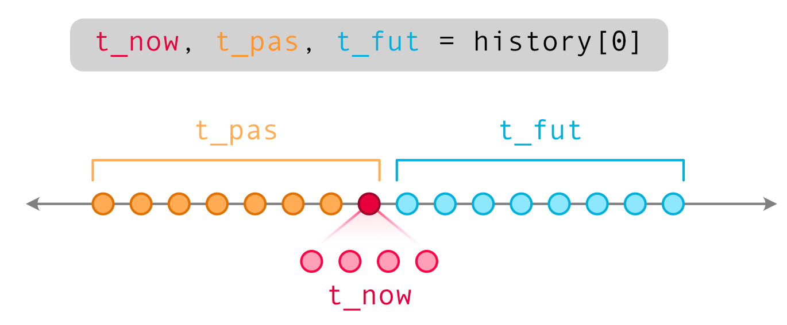

# TimeMachine -- handling time series data

## `TradingHistory(df, window_past=16, window_future=5)`

`TradingHistory` provides a pytorch dataset for training.

To setup this dataset, `df` should be provided as a `pandas.DataFrame`:

```python
import time_machine as tm


raw = tm.read_csv('OHLCV.txt')
history = tm.TradingHistory(raw)
```

#### `__getitem__(idx)`

This will return three `torch.Tensor`s:

1. OHLCV data for the `idx` day, time interval is 5 minutes
2. OHLCV data for the past `window_past` days, time interval is 1 day
3. OHLCV data for the future `window_future` days, time interval is 1 day

The time relation is shown below:



The `t_pas` will also include the information of `t_now`. But the `t_fut` will **not** include `t_now` for preventing information leaking. The `t_now` is the intra-day data for given `idx`.